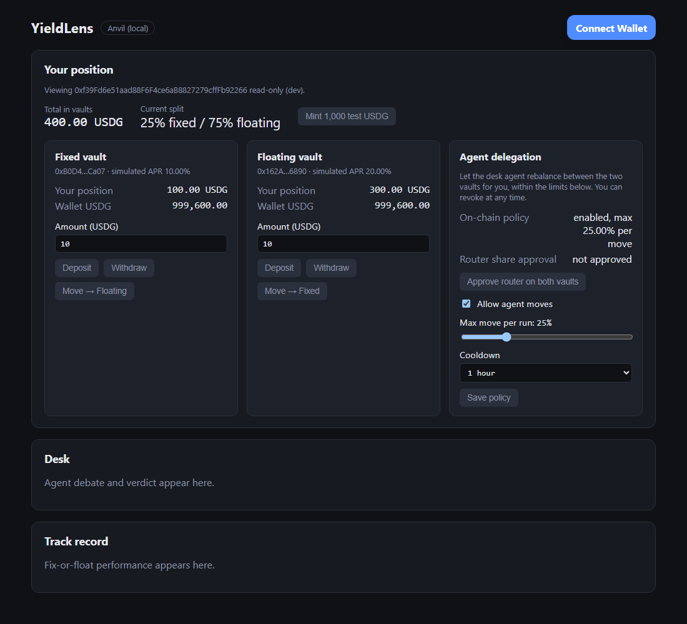
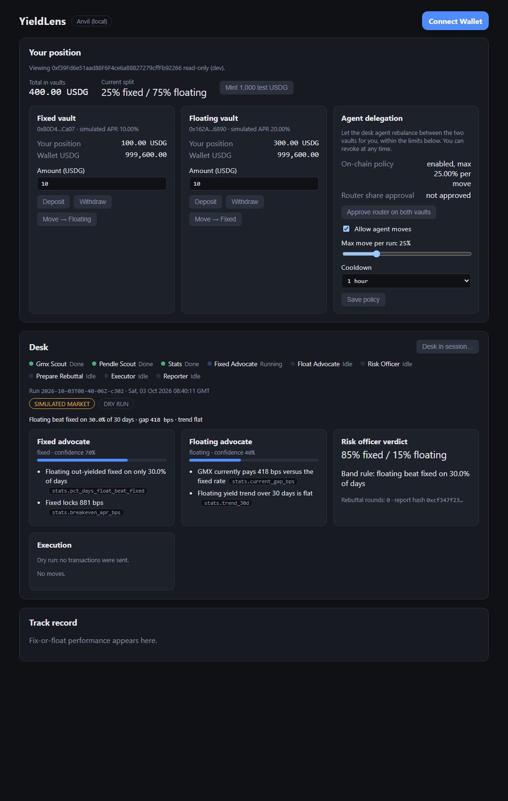
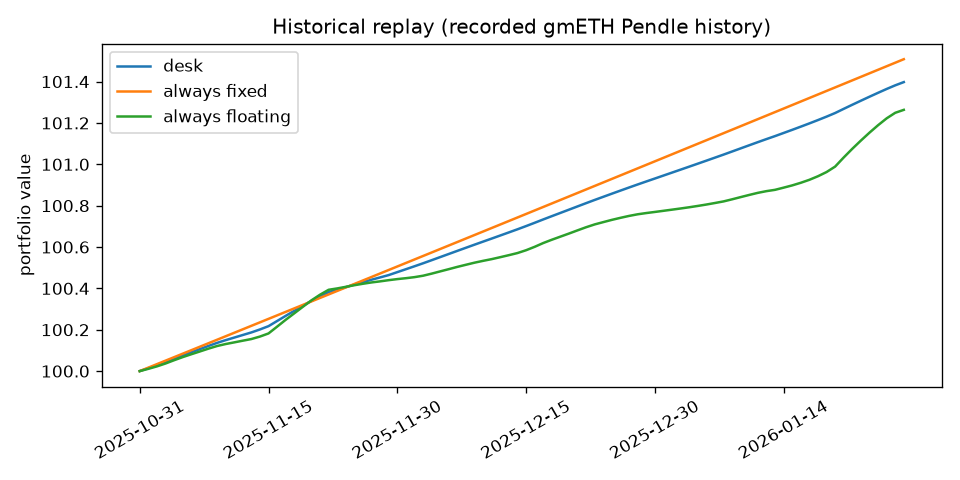

# YieldLens v2 — autonomous fix-or-float desk on Arbitrum

GMX liquidity providers face one recurring decision: keep floating fee yield on GMX, or lock a fixed rate on Pendle. YieldLens v2 is a team of AI agents that makes that decision continuously, argues it out in the open, and executes it on Arbitrum for users who opt in, inside limits those users set on-chain.

Demo video: _pending recording_ (script: [docs/demo-script.md](docs/demo-script.md)). Spec: [docs/superpowers/specs/2026-10-03-yieldlens-agentic-design.md](docs/superpowers/specs/2026-10-03-yieldlens-agentic-design.md).




> Screenshots live in `docs/screenshots/` (added with the web lane).

## Architecture

```
 ┌──────────────────────── off-chain (Python) ────────────────────────┐
 │  LangGraph "desk"                                                   │
 │  GmxScout ─┐                                                        │
 │            ├► FixedAdvocate ─┐                                      │
 │  PendleScout┘                ├► RiskOfficer ─► Verdict              │
 │            └► FloatAdvocate ─┘      ▲  rebuttal (≤1 round)          │
 │                                     ▼                               │
 │                       Executor (pure code) ─► Reporter              │
 └─────────┬───────────────────────────────────────────┬──────────────┘
           │ moveFor(user, from, to, amount, reportHash)│ DeskReport JSON
           ▼                                           ▼
 ┌──────── on-chain (Arbitrum Sepolia) ───────┐   FastAPI ─► React UI
 │ AgentRouter ──► FixedVault ──► PendleAdapter│           └► Dune
 │      │          FloatingVault► GmxAdapter   │
 │      └── per-user Policy, AGENT_ROLE        │
 └─────────────────────────────────────────────┘
```

| Folder | What lives there |
| --- | --- |
| `contracts/` | Foundry project: mock USDG, ERC-4626 strategy vaults, mock yield adapters, `AgentRouter` |
| `agents/` | LangGraph desk, data tools, executor, evals, historical replay |
| `api/` | FastAPI service: runs the desk, streams progress (SSE), serves stored reports |
| `web/` | React + wagmi UI: position, delegation, desk transcript, history, track record |
| `dune/` | Dune queries for the on-chain track record |

## Judging criteria

| Criterion | How v2 meets it |
| --- | --- |
| Deployed on an Arbitrum chain | Arbitrum Sepolia (guaranteed). Arbitrum One with real USDG is a v2 seam, not in scope. |
| Smart contract quality | OpenZeppelin ERC-4626 vaults, AccessControl, Pausable. Agents can only move funds between two allowlisted vaults, for opted-in users, within user-set caps. No path to withdraw to an external address. Foundry unit, fuzz and invariant tests. |
| Product-market fit | Progressive trust: users can watch the desk, move manually, or delegate with their own caps. Same product serves sceptics and believers; retention comes from the on-chain track record. |
| Innovation | Adversarial agent desk (two advocates, a risk officer that must address every argument) whose decisions are hashed on-chain and auditable from Dune back to the agent transcript. |
| Real problem | The GMX x Pendle integration is live; no tool connects the two yield models into a decision, let alone acts on it. |
| USDG bonus | USDG is the vault asset. Mock USDG on Sepolia (6 decimals, matching the real token); real USDG `0x004B506865409877C9fA29bfb1ebA929984B9bbC` on Arbitrum One behind the same interface. |

## Status and honest limits

- **Not deployed yet.** The Arbitrum Sepolia deploy is a human step; the addresses table below says "pending deploy" until it is done. Everything runs today against a local Anvil.
- **Pendle has no live GM market.** The spec assumes a live Pendle market on a GMX GM token. Today Pendle's Arbitrum markets named GM (`gmETH`, `GM ARB-USDC`) are all expired. The desk therefore reads the history of the most recent expired market and, by default, treats it as expired: the risk officer forces the fixed allocation to 0, the stale history triggers the freshness veto (so nothing moves), and the report carries an "EXPIRED MARKET" badge. For demos there is an explicit `simulate_live_market` mode (`--simulate-live-market`) that replays that history as if the market were live; every report produced that way is flagged `simulated` and the UI shows a "SIMULATED MARKET" badge.
- **Yields on Sepolia are mock.** The adapters accrue a simulated APR (10% fixed, 20% floating); no real GMX or Pendle position is opened.
- **No LLM key was available during development.** The graph is tested with fake LLMs and a deterministic rule-based LLM; the live-LLM path is written but unverified. See Evals.

## Deployed addresses (Arbitrum Sepolia, chainId 421614)

| Contract | Address |
| --- | --- |
| MockUSDG | pending deploy |
| Fixed vault (ylFIX) | pending deploy |
| Floating vault (ylFLT) | pending deploy |
| Fixed adapter | pending deploy |
| Floating adapter | pending deploy |
| AgentRouter | pending deploy |

After the deploy, fill this table from `contracts/deployments/arbitrum-sepolia.json` with Arbiscan links (`https://sepolia.arbiscan.io/address/<addr>`).

## Guardrails

The router admin is trusted: it can pause, grant and revoke the agent role, and set the vault pair exactly once (migration means deploying a new router: pause the old one and have users revoke their vault-share approvals on it). Use a multisig as admin in production.

What an agent key **can** do: call `moveFor` for users who opted in via `setPolicy`, between the two configured vaults only, up to each user's `maxMoveBps` of their total position, no more often than their cooldown, with the user always the receiver, and only while the router is not paused.

What it **cannot** do: withdraw to any other address, touch users who have not enabled a policy, move more than the user's cap, use vaults outside the pair, or act after the admin revokes `AGENT_ROLE` or pauses the router. Users stay in control: they can move or withdraw manually at any time and revoke the router's share approval.

`MockUSDG` and `MockYieldAdapter` are testnet-only: the mock token is an unrestricted faucet with a per-call mint cap, and only allowlisted adapters can mint yield.

## How the desk works

```
 gmx_scout ─┐
            ├► stats ─┬► fixed_advocate ─┐
 pendle_scout┘        └► float_advocate ─┴► risk_officer ──┬─ needs_rebuttal (once) ─► advocates again
                                                           └─► executor ─► reporter
```

Scouts and the stats step are plain code; the advocates and the risk officer are LLM calls with structured output. The executor is deterministic. The honesty rules are enforced in code, not in prompts:

1. Every argument must cite a real field of the stats or market snapshots through `evidence_field`; a case that cites anything else is rejected and retried once, then the run aborts with the error recorded and no execution.
2. All LLM outputs use schema-validated structured output. A parse failure retries once, then the run aborts.
3. Stale data forces a veto: if either market snapshot is older than `MAX_AGE_HOURS` (12 by default), the risk officer's verdict is overridden to vetoed.
4. If the Pendle market is expired or expires within `MIN_DAYS_TO_EXPIRY` (14), the fixed allocation is forced to 0 regardless of what the model said.
5. The executor never submits a transaction the contract would reject: it re-checks the user's policy, cooldown, cap and share approval locally, and skips with a recorded reason. The report hash passed to `moveFor` commits to the decision before execution, so a move on-chain can be matched to the exact transcript.

A run only moves funds when the new target differs from the last executed target by more than `MIN_CHANGE_BPS` (500).

## Does the desk beat always-fixed / always-floating?



```bash
cd agents
uv run python replay/replay.py --window 90 --cadence 1d --start-split 5000   # rule-only, no LLM
```

Over the recorded 90 days the desk ends at **101.40**, always-fixed at **101.51** and always-floating at **101.26** (start 100, 50/50 split, `MIN_CHANGE_BPS` gate of 500). So the desk landed between the two baselines: in this window fixed beat floating, and the desk, which started half floating and moved toward fixed, did not beat always-fixed.

Read this with care: the replay runs the deterministic band rule (no LLM), on the recorded Pendle history of the last expired GM market, with the fixed sleeve earning the implied APY locked at entry and the floating sleeve earning the daily underlying APY. Trading costs, slippage and gas are not modelled, and on Sepolia the vault yield is a mock accrual, not market yield. It demonstrates the mechanics, not an edge.

## Evals

`agents/evals/` holds 30 golden cases (20 sliding 30-day windows over the recorded Pendle history, 7 synthetic windows that cover the other two target bands, and stale-GMX, expiring-market and expired-market cases). Latest run (`uv run python evals/run_evals.py --mode cached`):

| Metric | Value |
| --- | --- |
| Cases | 30 |
| In-band rate | 1.00 |
| Veto accuracy | 1.00 |
| Citation validity | 1.00 |
| Mean tokens | 0 (not measured outside live mode) |

**Caveat:** the committed response cache was recorded with the deterministic rule-based stand-in (`recorded_with: "rule"`) because no LLM key was available. These numbers are a plumbing check of the graph, guards and scoring, not evidence about model quality. Re-record with `uv run python evals/run_evals.py --mode live --record` once a key exists.

## Run locally

```bash
# contracts
cd contracts && forge test

# agents (needs ANTHROPIC_API_KEY or OPENAI_API_KEY for a real run)
cd agents && uv sync && uv run pytest
uv run python -m desk.run --dry-run --simulate-live-market

# api (serves data/runs, runs the desk on POST /desk/run)
cd api && uv sync && uv run uvicorn app.main:app --reload
uv run python scripts/dev_server.py --fake-runner     # demo without an LLM key: replays a canned run

# web
cd web && npm i && cp .env.example .env && npm run dev
```

For a full local loop without Sepolia: start `anvil --port 8546`, deploy with `forge script script/Deploy.s.sol --rpc-url http://127.0.0.1:8546 --broadcast` (see the next section for the env vars), copy the written JSON to `web/public/deployments.anvil.json`, then run the web app with `VITE_CHAIN=anvil`.

## Deploy to Arbitrum Sepolia

Human step; needs a funded deployer key on Arbitrum Sepolia (chainId 421614).

```bash
cd contracts
export ARBITRUM_SEPOLIA_RPC_URL=...      # RPC endpoint
export DEPLOYER_PRIVATE_KEY=0x...        # deployer / vault owner / router admin
export AGENT_ADDRESS=0x...               # address of the agent key (gets AGENT_ROLE)
export ETHERSCAN_API_KEY=...         # Etherscan V2 key (also valid for Arbiscan)
forge script script/Deploy.s.sol --rpc-url arbitrum_sepolia --broadcast \
  --verify --verifier etherscan --etherscan-api-key $ETHERSCAN_API_KEY --chain 421614
# fallback (legacy Arbiscan API): --verify --etherscan-api-key $ARBISCAN_API_KEY --verifier-url https://api-sepolia.arbiscan.io/api
./export-abis.sh
```

The script writes `contracts/deployments/arbitrum-sepolia.json` (commit it). ABIs live in `contracts/deployments/abi/`; `arbitrum-sepolia.example.json` shows the shape with zero addresses. Then set the repository variable `API_URL` once the API is hosted, so the 6-hourly `desk-cron` workflow can trigger runs.

## Environment variables

| Variable | Used by | Purpose |
| --- | --- | --- |
| `ARBITRUM_SEPOLIA_RPC_URL` (or `RPC_URL`) | contracts, agents | RPC endpoint |
| `DEPLOYER_PRIVATE_KEY` | contracts | Deploys; becomes vault owner and router admin |
| `AGENT_ADDRESS` | contracts | Address granted `AGENT_ROLE` at deploy |
| `AGENT_PRIVATE_KEY` | agents, api | Signs `moveFor`; only ever lives in the API/agent environment |
| `ANTHROPIC_API_KEY` / `OPENAI_API_KEY` | agents | LLM provider (`LLM_PROVIDER=anthropic\|openai`) |
| `ETHERSCAN_API_KEY` | contracts | Contract verification |
| `LANGCHAIN_TRACING_V2`, `LANGCHAIN_API_KEY` | agents | Optional LangSmith tracing |
| `WEB_ORIGIN` | api | Extra CORS origin for the web app |
| `API_URL` (repository variable) | CI | Target of the scheduled desk run |
| `VITE_API_URL` | web | API base URL (default `http://localhost:8000`) |
| `VITE_WALLETCONNECT_PROJECT_ID` | web | WalletConnect project id |
| `VITE_DUNE_EMBED_URL` | web | Dune dashboard embed on the Track Record panel |
| `VITE_CHAIN` | web | `anvil` to use the local chain |

Secrets stay in the environment: never committed, never logged, never shipped to `web/`.

## Roadmap (v2)

- Real GMX and Pendle adapters behind `IYieldAdapter`.
- Arbitrum One deployment with real USDG (`0x004B506865409877C9fA29bfb1ebA929984B9bbC`).
- Per-user agent preferences beyond on-chain policy parameters.
- A live Pendle GM market listing, which would remove the need for the simulated-market demo mode.
- Recorded live-LLM eval cache and a hosted API with scheduled runs.
